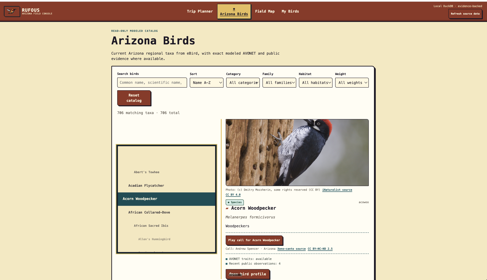

Databox began as a local-first warehouse: public data in, DuckDB file out. That is useful, but it is not enough to support a product. A product needs refreshes that preserve one local database, transformations that preserve meaning, and an interface that does not have to rediscover every provider's naming scheme.

Since July 6, the useful chain has become:

```text
parallel ingestion
-> reviewed source semantics
-> ontology and canonical data model
-> SQLMesh business models
-> Rufous, a local birding application
```

Rufous is the proof surface, not the warehouse's purpose. It is a reference consumer that makes the quality of the warehouse visible.

## One local database, many source clients

Databox uses DuckDB for the warehouse, dlt for ingestion, SQLMesh for transformations, Soda for validation, and Dagster for orchestration. The awkward part is that a DuckDB file is not a server built for independent writers.

[Quack](https://github.com/Doctacon/databox/commit/441bb36) provides that boundary: one server owns `data/databox.duckdb` while isolated `parallel_refresh` dlt clients connect through its protocol. Required source loads overlap, retain their own state, and write their own `raw_<source>` schemas. A failed source fails the refresh before SQLMesh runs; it does not become mysterious damage in a shared `main` schema.


flowchart TB
  accTitle: Parallel refresh and independent pinned-file paths
  accDescr: Parallel-refresh dlt clients write through one Quack-owned DuckDB server before SQLMesh runs. AVONET follows a separate pinned-file refresh and atomic publication path.
  clients[parallel-refresh dlt clients] --> quack[Quack server<br/>owns data/databox.duckdb]
  quack --> raw[isolated raw_source schemas]
  raw --> complete{Required loads succeed?}
  complete -->|yes| sqlmesh[SQLMesh business models]
  complete -->|no| failed[Refresh fails<br/>with source attribution]

  avonet[AVONET pinned snapshot] --> independent[Independent refresh]
  independent --> publish[Atomic raw_avonet publication]


AVONET is the deliberate exception: a static pinned file snapshot outside shared parallel refresh, with atomic publication after its own refresh. The point is not one cadence for every source. It is an explicit refresh contract for each source. Dagster still owns orchestration and the asset view; Quack owns the local write boundary; SQLMesh remains downstream of successful source completion.

<figure class="databox-case-study-proof">
  
  <figcaption>Databox lineage makes the route from public-source ingestion to derived observations and birding analysis inspectable.</figcaption>
</figure>

## Raw tables are not a domain model

dlt gets data into tables; it does not decide what those tables mean. An eBird observation, a weather measurement, and an animal-trait record do not acquire a shared vocabulary by landing in DuckDB. Querying raw provider tables from application code would repeat source-specific assumptions in every feature.

Databox makes the review path explicit: observed dlt schema becomes annotated taxonomy, then ontology, a Kimball-style canonical data model, and finally SQLMesh business models. Every registered raw table must be modeled or explicitly excluded; modeled concepts must reach the ontology, CDM, and a transformed business table.

<div class="databox-semantic-workflow databox-semantic-workflow--desktop">


flowchart LR
  accTitle: Databox semantic warehouse path
  accDescr: Observed dlt schema passes through reviewed taxonomy, ontology, canonical data model, SQLMesh transformations, and then supports Rufous as a reference consumer.
  raw[Observed dlt schema] --> annotate[annotate-sources<br/>reviewed taxonomy]
  annotate --> ontology[create-ontology<br/>entity graph]
  ontology --> cdm[generate-cdm<br/>Kimball-style CDM]
  cdm --> transform[create-transformation]
  transform --> sqlmesh[SQLMesh business models]
  sqlmesh --> rufous[Rufous reference consumer]


</div>

<div class="databox-semantic-workflow databox-semantic-workflow--mobile">


flowchart TB
  accTitle: Databox semantic warehouse path
  accDescr: Observed dlt schema passes through reviewed taxonomy, ontology, canonical data model, SQLMesh transformations, and then supports Rufous as a reference consumer.
  raw[Observed dlt schema] --> annotate[annotate-sources<br/>reviewed taxonomy]
  annotate --> ontology[create-ontology<br/>entity graph]
  ontology --> cdm[generate-cdm<br/>Kimball-style CDM]
  cdm --> transform[create-transformation]
  transform --> sqlmesh[SQLMesh business models]
  sqlmesh --> rufous[Rufous reference consumer]


</div>

The sequence matters because it makes choices reviewable before they harden into SQL. `annotate-sources` starts from dlt's observed schema—columns, types, keys, and nullability—not a whiteboard. It maps tables to confirmed concepts or excludes them with a reason. `create-ontology` records entities, relationships, source mappings, and any natural-key strategy; it does not silently merge two providers because their records look similar.

`generate-cdm` then gives facts an explicit grain and dimensions a key strategy before transformation SQL exists. `create-transformation` comes last: dlt remains ingestion, while SQLMesh maps reviewed raw sources into facts and dimensions. That turns “we should model this later” into a traceable business-facing path.

## Rufous is the reference consumer

Rufous is a local birding application with an Arizona catalog, Watch state, trip planning, explicit calendar invitations, alerts, and a local Field Map.

<figure class="databox-case-study-proof">
  
  <figcaption>Rufous is the reference consumer: a local field console built on inspectable birding concepts, not provider response objects.</figcaption>
</figure>

The [Databox README](https://github.com/Doctacon/databox/blob/main/README.md) calls Rufous a reference consumer, not the core project. That distinction keeps Databox from becoming an app-specific backend while giving it a demanding user. The catalog and planner can begin with stable concepts rather than raw provider objects; the Field Map can consume a local, inspectable data surface.

A CDM did not generate the product UI. Rufous still has its own interaction, accessibility, privacy, and visual decisions. The narrower payoff is that product work starts from verified domain concepts instead of raw-provider archaeology.

## Make the contract executable

Subsequent hardening made that workflow harder to drift. Databox made the Python registry canonical for seven registered sources, then derived CI coverage from it instead of maintaining a second active-source list. The registry owns source identity, raw-table inventory, cadence, freshness, domain identity, and verification profile. The repository checks source builders, raw-table inventory, verification profiles, modeling completeness, relevant Quack parity, and fixture integrity/privacy.

The final recorded verification covered 871 tests, including offline and isolated source suites, focused contract tests, and a complete seven-source contract/matrix check. The number is not the conclusion. The conclusion is that ingestion inventory and semantic workflow are now things the repository can reject when they drift.

## The useful shape

Databox stays deliberately local: concurrent dlt clients write through one Quack server; reviewed semantics become facts and dimensions through SQLMesh; Rufous proves those business models are usable.

There are limits. Semantics still require review where source vocabulary, natural keys, relationships, grain, and precedence become product decisions. Rufous does not prove every future consumer fits the same model, and tests do not make providers stable. But this is a better boundary: local ownership without sequential ingestion, semantics before SQL, and a real consumer that exposes whether the warehouse is actually useful. The workflow does not remove judgment; it gives that judgment a durable place to live before it reaches an application.
