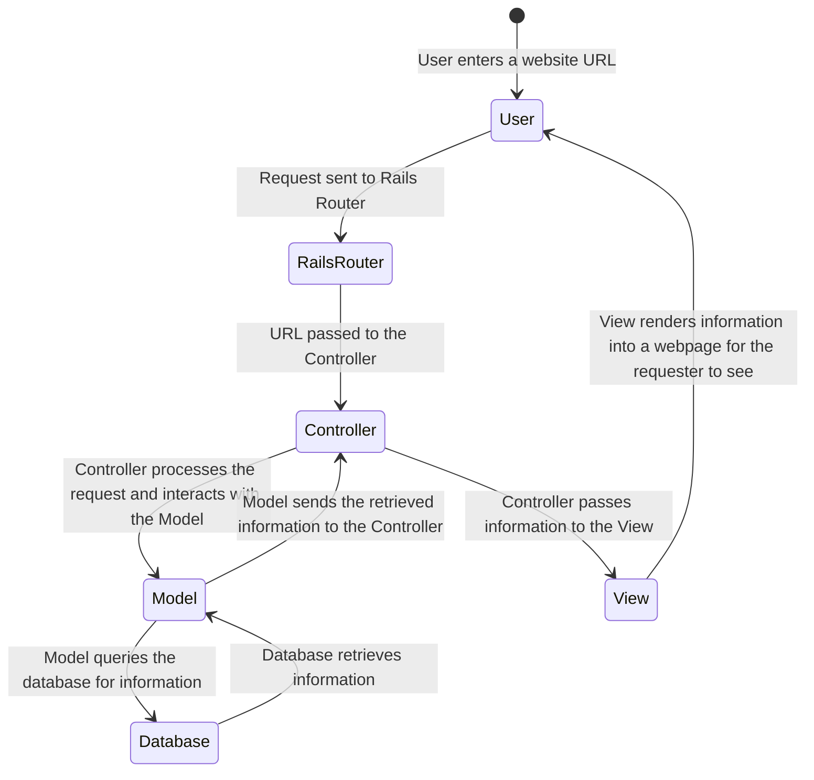

## Introduction

Are you looking to create a wedding photo collection website to capture the joyous moments of your special day? Perhaps for your little sister, who doesn't quite understand what a **dATa EnGinEEr** is but has unwavering faith in your technical prowess? In this step-by-step guide I'll walk you through the process of building your own website using Ruby on Rails, Active Storage, AWS S3, GoDaddy, and Heroku. Whether you're tech-savvy or new to web development (like me), this guide will help you bring your vision to life.

> [!TIP]
> Check out [this repository](https://github.com/CR-Lough/nanner_wedding/tree/main) to see the end product.

## Step 1: setting up your environment

Before we start coding, let's ensure your development environment is ready for action.

1. **Install Visual Studio Code (VS Code).** A user-friendly code editor like VS Code is perfect for beginners. Download and install it from [Visual Studio Code's website](https://code.visualstudio.com/).
2. **Install Ruby.** Ruby is the programming language that powers Ruby on Rails. Download and install it from the [official Ruby website](https://www.ruby-lang.org/en/documentation/installation/).
3. **Install Rails.** Ruby on Rails is a framework built on top of Ruby. Open your terminal and run `gem install rails`.
4. **Install Git.** Git is a version control system that helps you manage your code changes. Download and install Git from [git-scm.com](https://git-scm.com/downloads).

## Step 2: creating your Rails project

Now that your environment is set up, let's create your Rails project.

1. **Open Terminal.** Open the terminal on your computer. If you're on Windows, use the Command Prompt or PowerShell.
2. **Navigate to your preferred directory.** Use `cd` to navigate to the directory where you want to create your project. For example:
   ```bash
   cd Documents
   ```
3. **Generate your project.** Run the following command to create your Rails project:
   ```bash
   rails new wedding_photos_app
   ```

## Step 3: understanding Rails basics

Before we dive into creating the website, let's understand some Rails basics.

1. **The MVC architecture.** Rails follows the Model-View-Controller (MVC) architecture. It separates your application into three components: the Model (manages data), the View (displays information), and the Controller (handles user requests).
2. **Routes.** Routes define how URLs map to different parts of your application. They're defined in the `config/routes.rb` file.



In this diagram:

- The initial state `[*]` represents the starting point where a user enters a website URL.
- The user's input is then sent to the Rails Router.
- The Rails Router directs the request to the appropriate Controller.
- The Controller interacts with the Model to handle the request.
- The Model queries the database for information and receives the results from the Database.
- The Model sends the retrieved information back to the Controller.
- The Controller passes the information to the View.
- Finally, the View renders the information into a webpage that the user sees.

## Step 4: model creation

Time to create the foundation for your photo collection.

1. **Generate a model.** Run the following command to generate a model named `Photo` with attributes:
   ```bash
   rails generate model Photo title:string description:text
   ```
2. **Apply migrations.** Migrations are scripts that create or update your database schema. Run the migration to create the `photos` table:
   ```bash
   rails db:migrate
   ```

## Step 5: Active Storage and AWS S3 integration

Active Storage is a Rails framework for handling file uploads and attachments. In a nutshell, Active Storage stores URL redirects in the backend database and serves images on the front end. Much better performance. We'll integrate it with AWS S3 for efficient storage and retrieval.

1. **Configure AWS S3.** Set up an AWS S3 bucket to store your images. [I found this YouTube video to be the most helpful.](https://www.youtube.com/watch?v=y1Ks3ET0A40)
2. **Add Active Storage to your model.** In `app/models/photo.rb`, add the following line to enable Active Storage. Detailed instructions can be found in the [Active Storage Overview](https://guides.rubyonrails.org/active_storage_overview.html).
   ```ruby
   class Photo < ApplicationRecord
     has_one_attached :image
     # ... other model code ...
   end
   ```

## Step 6: building your photo upload feature

Now, let's implement the feature that allows users to upload wedding photos.

1. **Generate a controller.** Run the following command to generate a controller named `Photos`:
   ```bash
   rails generate controller Photos
   ```
2. **Create actions.** Define actions in the `PhotosController` for different operations (`index`, `new`, `create`). Customize these actions to handle photo uploads.

## Step 7: creating views

Views are essential for displaying data to users. Let's create views for your photo collection.

1. **Create index view.** In `app/views/photos`, create a file named `index.html.erb` and add the following content:
   ```erb
   <h1>Wedding Photos Collection</h1>

   <% @photos.each do |photo| %>
     <div class="photo-card">
       <h3><%= photo.title %></h3>
       <p><%= photo.description %></p>
       <%= image_tag photo.image if photo.image.attached? %>
     </div>
   <% end %>
   ```
2. **Create form view.** In the same directory, create a file named `new.html.erb` and add the following content:
   ```erb
   <h1>Upload a New Photo</h1>

   <%= form_with(model: @photo, url: photos_path, local: true) do |form| %>
     <div class="form-group">
       <%= form.label :title %>
       <%= form.text_field :title, class: "form-control" %>
     </div>
     <div class="form-group">
       <%= form.label :description %>
       <%= form.text_area :description, class: "form-control" %>
     </div>
     <div class="form-group">
       <%= form.file_field :image, class: "form-control" %>
     </div>
     <%= form.submit "Upload", class: "btn btn-primary" %>
   <% end %>
   ```

## Step 8: styling and layout

Time to make your website visually appealing.

1. **Bootstrap integration.** Bootstrap is a popular front-end framework. Add Bootstrap to your project by including it in your application layout file (`app/views/layouts/application.html.erb`). A great video walkthrough is provided [here, by Deanin](https://www.youtube.com/watch?v=5e3enFye--U).

## Step 9: deploying your website

Your website is ready to go online.

1. **Create a Heroku account.** If you don't have one, create a [Heroku](https://www.heroku.com/) account.
2. **Deploy your app.** Use the Heroku CLI to deploy your application. Follow the detailed steps in the [Heroku Getting Started with Rails guide](https://devcenter.heroku.com/articles/getting-started-with-rails6).

> [!NOTE]
> Heroku turned off automatic Postgres provisioning in May 2023. You'll need to manually add this under the "Resources" tab in your application.

## Step 10: user authentication

To keep your website secure, implement user authentication. Let's use basic HTTP authentication for simplicity:

In your `ApplicationController`, add the following code:

```ruby
class ApplicationController < ActionController::Base
  http_basic_authenticate_with name: "your_username", password: "your_password"
end
```

## Step 11: custom domain with GoDaddy

Make your website memorable with a custom domain.

1. **Buy a domain.** Purchase a domain from a registrar like [GoDaddy](https://www.godaddy.com/) or your preferred provider.
2. **Point to Heroku.** Configure the CNAME record in GoDaddy's settings to point to your Heroku app's URL. This step ensures visitors can access your site using the custom domain. [I found this YouTube video helpful.](https://www.youtube.com/watch?v=4hikWqrSmFA&t=152s)

## Conclusion

Congratulations — you've accomplished an incredible feat by creating your own wedding photo collection website from scratch. This guide has equipped you with the fundamental knowledge and practical steps needed to embark on your web development journey.

Remember, every step you've taken here can be a stepping stone for your future projects. Continue exploring Rails, experimenting with new features, and expanding your skills.
