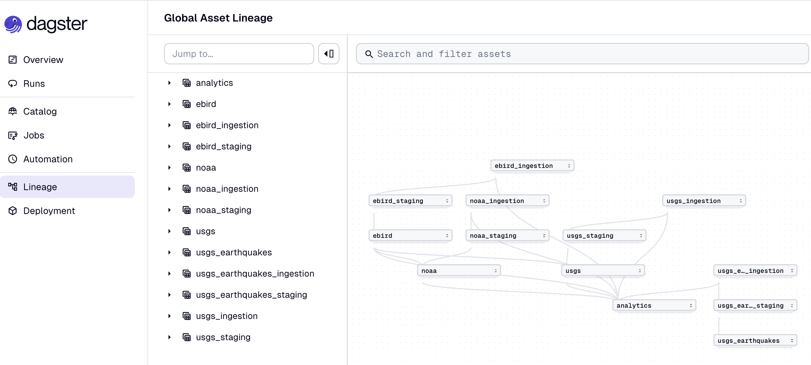

A single-operator data platform that ingests three public APIs (eBird, NOAA, USGS) into one queryable cross-domain warehouse. Zero always-on infra: file-based DuckDB locally, MotherDuck cloud with one environment flag. Every layer — ingest, transform, quality, orchestration, semantic metrics, data dictionary — is wired end-to-end through the same open-source stack.

The project exists to answer one question: *do species distributions shift with same-day weather and streamflow anomalies?* The platform around it exists to answer that question honestly, repeatably, and with receipts.

## Links

- **Code** — [github.com/Doctacon/databox](https://github.com/Doctacon/databox)
- **Data dictionary** — [doctacon.github.io/databox](https://doctacon.github.io/databox/)

## Stack

- **[dlt](https://dlthub.com/)** — Python-native ingestion, auto-schema inference
- **[SQLMesh](https://sqlmesh.com/)** — SQL transforms with virtual environments and native semantic metrics
- **[DuckDB](https://duckdb.org/)** + **[MotherDuck](https://motherduck.com/)** — analytical warehouse, local-to-cloud via one env flag
- **[Dagster](https://dagster.io/)** — sole orchestrator; ingest, transform, and quality run as assets in one DAG
- **[Soda Core](https://www.soda.io/soda-core)** — contract-based quality run as Dagster asset checks
- **[MkDocs-Material](https://squidfunk.github.io/mkdocs-material/)** — auto-generated data dictionary site

## What it demonstrates

- **Cross-domain modeling.** Bird observations, weather, and streamflow joined at a shared spatial grain (H3 cells × day).
- **Semantic metrics layer.** One canonical SQL definition per KPI, queryable by name.
- **Contract-based quality.** Every model has a Soda contract gated as a Dagster asset check; failures block downstream materialization.
- **Schema-contract CI gate.** Breaking changes to contracts require explicit opt-in via PR marker.
- **Auto-generated data dictionary.** Every model's columns, types, checks, and lineage discoverable without cloning the repo.
- **Idempotent incremental ingest.** Reruns don't double-count.
- **Portable local ↔ cloud.** Identical SQL; environment-variable switch between DuckDB file and MotherDuck.
