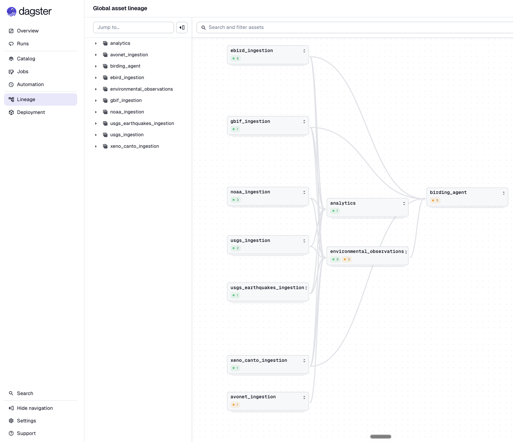

# Databox

Databox is a local-first, forkable data-warehouse scaffold for engineers who want to inspect—and adapt—a complete path from public source to trusted model. It uses dlt for ingestion, DuckDB for the warehouse, SQLMesh for transformation, Soda for validation, and Dagster for orchestration, without always-on infrastructure.

The included eBird, NOAA, and USGS sources are working reference implementations, not the point of the project. Fork the scaffold, keep the end-to-end examples long enough to see the pattern work, then replace them with your own sources.

## Architecture you can inspect

- **Local warehouse path.** DuckDB keeps the warehouse portable and directly inspectable.
- **One operating graph.** Dagster orchestrates ingestion, transformations, and quality work so lineage and operational dependencies stay visible.
- **Quality as a control.** Soda contracts run as Dagster asset checks and can gate downstream materialization.
- **Models with receipts.** SQLMesh models, contracts, and generated documentation make definitions, checks, and lineage inspectable.



*Dagster global asset lineage makes the route from source ingestion through derived observations and analytics to the Rufous reference consumer inspectable.*

## From source to model

A new dlt source moves through a reviewable modeling workflow before transformation SQL is written:

1. **Schema** — land the source and inspect its dlt schema.
2. **Annotation** — add source annotations and taxonomy.
3. **Ontology** — define the business concepts the source contributes.
4. **Kimball CDM** — generate a business-aware canonical data model.
5. **Transformation** — write SQLMesh models against that reviewed model.

The scaffold enforces the ingestion shape, source registry, orchestration, tests, and source-to-model coverage in local checks and CI. A registered source is not merely an API client; it has a defined identity, raw-table inventory, Dagster asset and job, verification profile, and modeled business-table responsibility.

## Reference sources and consumer

**eBird, NOAA, and USGS** demonstrate the source pattern end to end: public API data lands through dlt, becomes modeled warehouse data, is checked, and is available through the same operating graph. They are examples a fork can retain, replace, or extend.

**Rufous** is a reference consumer of the warehouse, not Databox’s core product. It demonstrates that the platform can serve an application without making the birding use case a requirement for the scaffold.

## Technical details

- [Repository](https://github.com/Doctacon/databox)
- [Documentation and data dictionary](https://doctacon.github.io/databox/)
- [Architecture decisions](https://github.com/Doctacon/databox/tree/main/docs/adr)
- [Source-layout convention](https://github.com/Doctacon/databox/blob/main/docs/source-layout.md)
- [Forking and rebranding guide](https://github.com/Doctacon/databox/blob/main/docs/template.md)

Databox is public architecture evidence: a small, complete system whose controls, tradeoffs, and extension path can be inspected before anyone has to trust a claim about it.

If you are working through a similar reliability problem, [Tell me what’s brittle](mailto:connor@loughondata.com?subject=Tell%20me%20what%27s%20brittle&body=What%20is%20unreliable%3F%0A%0AWho%20relies%20on%20it%3F%0A%0AWhat%20outcome%20do%20you%20need%3F).
